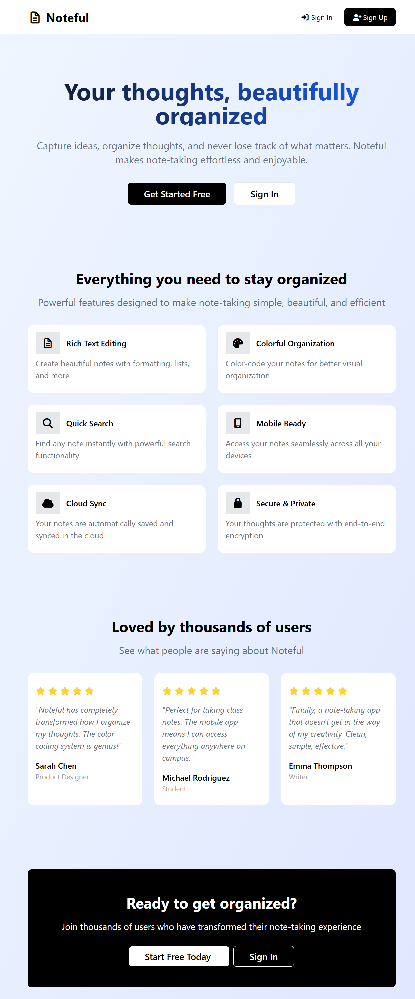
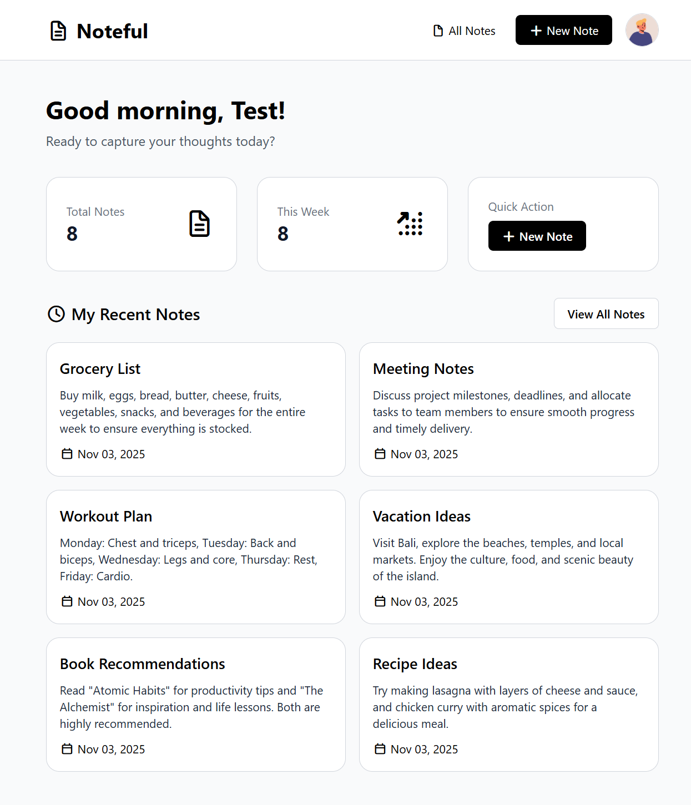
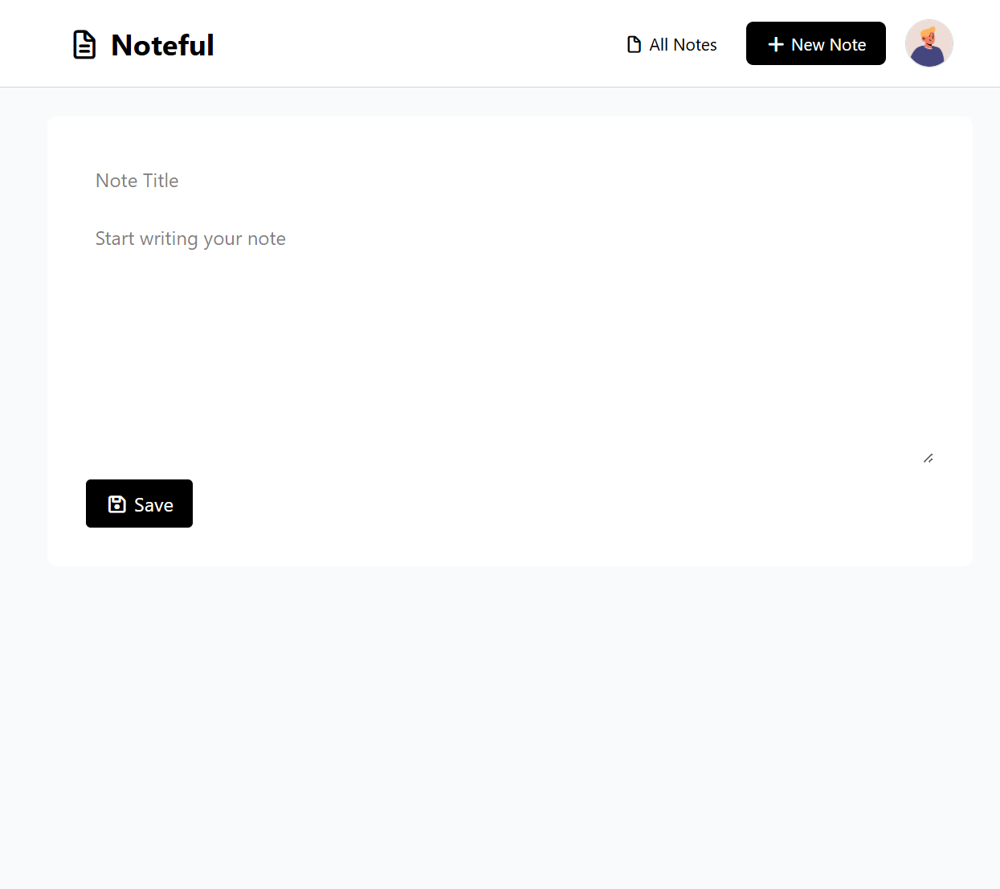
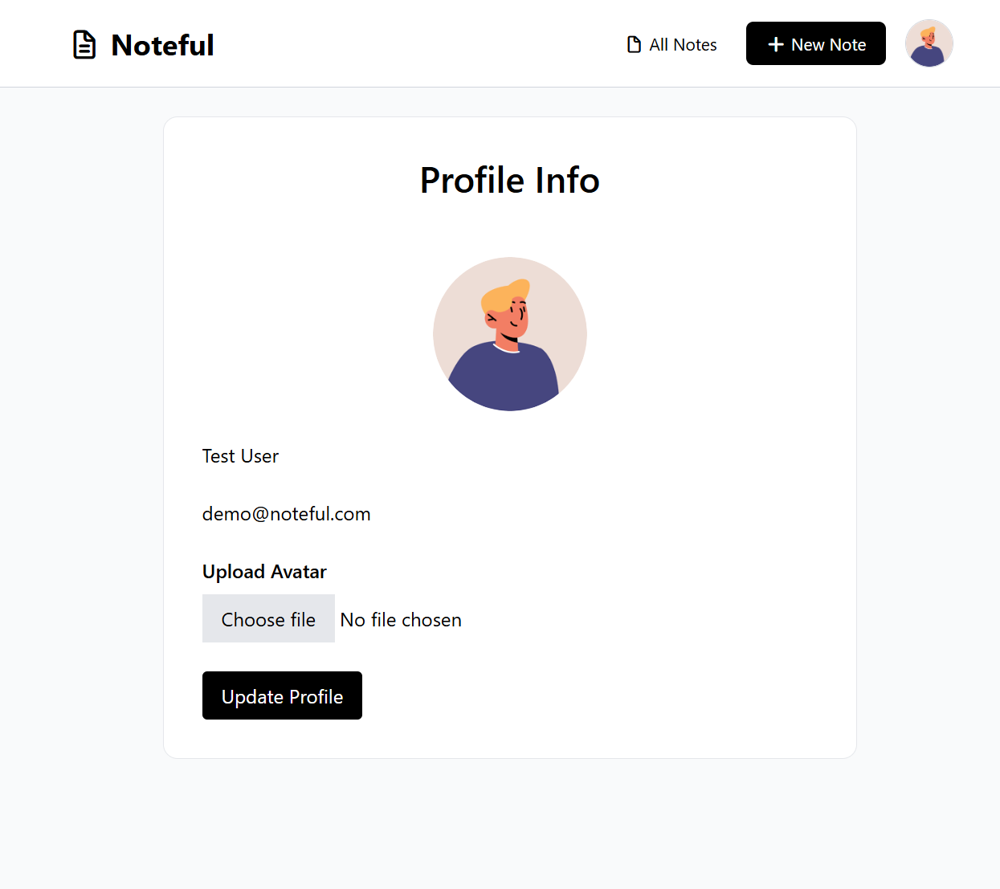

# Noteful - A Modern Note-Taking Application

## 📝 Overview

Noteful is a sleek and intuitive note-taking application built with Laravel and modern web technologies. This project showcases my proficiency in full-stack web development, focusing on clean architecture, user experience, and modern development practices.



<!-- Add your home page screenshot here -->

## ✨ Features

-   **User Authentication**

    -   Secure registration and login system
    -   Profile management with avatar support
    -   Protected routes and authenticated sessions

-   **Note Management**

    -   Create, read, update, and delete notes
    -   Pin important notes to the top
    -   Customize note background colors
    -   Rich text descriptions

-   **User Interface**
    -   Modern and responsive design using TailwindCSS
    -   Intuitive dashboard layout
    -   Smooth animations and transitions

## 🛠️ Technologies Used

-   **Backend**

    -   Laravel 12.0 (PHP 8.2)
    -   MySQL Database
    -   Laravel Authentication
    -   Pest PHP for Testing

-   **Frontend**

    -   Blade Templates
    -   TailwindCSS 4.0
    -   Vite for Asset Bundling
    -   Axios for HTTP requests

-   **Development Tools**
    -   Laravel IDE Helper
    -   Laravel Pint (Code Style)
    -   Laravel Sail (Docker)
    -   Faker for Test Data

## 📸 Screenshots

### Dashboard



<!-- Add your dashboard screenshot here -->

### Note Creation



<!-- Add your note creation page screenshot here -->

### Profile Management



<!-- Add your profile page screenshot here -->

## 🚀 Installation

1. Clone the repository

```bash
git clone https://github.com/iharpreetbhatti/noteful.git
cd noteful
```

2. Install PHP dependencies

```bash
composer install
```

3. Install NPM dependencies

```bash
npm install
```

4. Set up environment file

```bash
cp .env.example .env
php artisan key:generate
```

5. Configure your database in `.env` file

```env
DB_CONNECTION=mysql
DB_HOST=127.0.0.1
DB_PORT=3306
DB_DATABASE=noteful
DB_USERNAME=your_username
DB_PASSWORD=your_password
```

6. Run migrations and seed the database

```bash
php artisan migrate
php artisan db:seed
```

7. Start the development server

```bash
composer dev
```

## 🔒 Security

-   CSRF protection enabled
-   SQL injection prevention
-   XSS protection
-   Authenticated routes
-   Password hashing
-   Form validation

## 🌟 Future Enhancements

-   [ ] Note sharing functionality
-   [ ] Tags and categories
-   [ ] Rich text editor integration
-   [ ] Dark mode support
-   [ ] Export notes feature
-   [ ] Mobile application

## 📄 License

This project is open-sourced under the [MIT license](LICENSE).

## 👨‍💻 About the Developer

Built with 💚 by Harpreet Bhatti as a showcase project to demonstrate proficiency in:

-   Laravel Framework
-   Modern PHP Development
-   Frontend Development
-   Database Design
-   Version Control
-   Project Architecture
